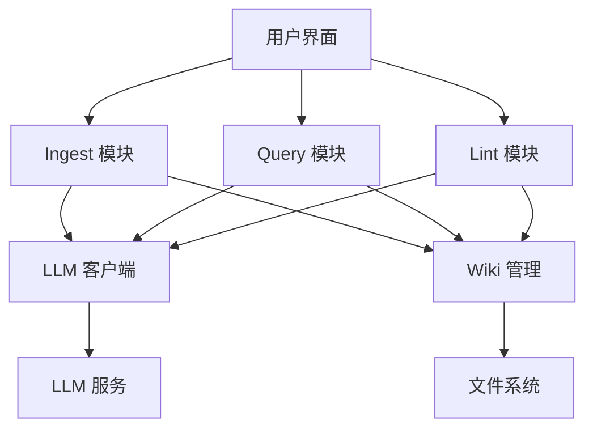

# Python 版本核心功能分析报告

## 1. 核心模块分析

### 1.1 Ingest 模块 (`ingest/pipeline.py`)

**功能概述**：
- 将原始内容（网页、视频、PDF、Word 等）处理并转换为结构化的 Wiki 页面
- 支持 SCHEMA v1.1 规范
- 包含知识提炼、内容完整性检查、知识结构化等核心功能

**核心流程**：
1. 保存原始内容到 `raw/` 目录
2. 推断页面类型（page_type）
3. 读取 SCHEMA.md 内容
4. 查找相关条目（用于增量合并）
5. 调用 LLM 编译内容（生成 Markdown）
6. 解析 LLM 返回的 Markdown，写入 `wiki/` 目录
7. 生成索引页面
8. 执行质量检查
9. 生成知识图谱

**关键函数**：
- `run_ingest()`：核心入口函数，协调整个摄入流程
- `_write_markdown_pages()`：将 LLM 返回的 Markdown 写入 wiki 目录
- `_ensure_frontmatter()`：确保 Markdown 有完整的 frontmatter
- `_generate_index_page()`：生成知识索引页面
- `build_knowledge_graph()`：建立知识图谱

**依赖关系**：
- 依赖 `ingest/finder.py` 中的 `find_related()` 函数查找相关条目
- 依赖 `lint` 模块进行质量检查
- 依赖 LLM 客户端进行内容编译

### 1.2 Query 模块 (`query/__init__.py`)

**功能概述**：
- 处理用户查询，搜索 wiki 目录中的相关内容
- 调用 LLM 生成综合回答
- 支持将高质量答案保存到 Wiki
- 支持知识缺口分析和回填

**核心流程**：
1. 搜索相关条目
2. 构建智能上下文
3. 调用 LLM 生成回答
4. 保存回答到 `outputs/` 目录
5. 回填新知识到 wiki（如果有）
6. 保存到 Wiki（如果请求）

**关键函数**：
- `run_query()`：核心入口函数，处理用户查询
- `_search_wiki()`：搜索 wiki 目录中的相关内容
- `_build_context()`：构建智能上下文
- `_write_query_to_wiki()`：将查询答案保存到 Wiki

**依赖关系**：
- 依赖 LLM 客户端生成回答
- 依赖文件系统操作保存结果

### 1.3 Lint 模块 (`lint/__init__.py`)

**功能概述**：
- 扫描 wiki 目录，检查知识库质量
- 发现矛盾、过时信息、缺失链接等问题
- 生成质量报告

**核心流程**：
1. 读取所有 wiki 条目
2. 收集所有内容摘要构建全局上下文
3. 收集所有 wikilinks
4. 调用 LLM 评估知识库质量
5. 执行自动检测（不调用 LLM）
6. 保存报告到 `outputs/` 目录

**关键函数**：
- `run_lint()`：核心入口函数，协调整个质量检查流程
- `_auto_check()`：自动质量检查（不调用 LLM）
- `_save_report()`：保存质量报告
- `_parse()`：解析 Markdown 内容

**依赖关系**：
- 依赖 LLM 客户端进行质量评估
- 依赖文件系统操作读取 wiki 条目

### 1.4 LLM 客户端 (`llm/__init__.py`)

**功能概述**：
- 封装与 LLM 服务的通信
- 支持不同模型的响应格式
- 提供 ingest、query、lint 三种模式的调用

**核心功能**：
1. 流式和非流式响应支持
2. 模型预热
3. 错误处理和重试机制
4. JSON 解析和容错处理

**关键函数**：
- `chat()`：通用聊天接口
- `ingest()`：按 SCHEMA 规范编译原始资料
- `query()`：处理用户查询
- `lint()`：评估知识库质量
- `_parse_json()`：解析 LLM 返回的 JSON

**依赖关系**：
- 依赖 `requests` 库进行 HTTP 通信
- 依赖 `json` 库进行 JSON 解析

## 2. 关键依赖分析

### 2.1 文件处理库

| 依赖 | 用途 | TypeScript 替代方案 |
|------|------|-------------------|
| PyMuPDF | PDF 处理 | pdf-parse 或 pdfjs |
| python-docx | Word 处理 | mammoth.js |
| Markdown 处理 | Markdown 解析和生成 | marked 或 remark |

### 2.2 网络请求库

| 依赖 | 用途 | TypeScript 替代方案 |
|------|------|-------------------|
| requests | HTTP 客户端 | axios 或 fetch API |
| trafilatura | 网页内容提取 | node-html-parser 或 cheerio |
| BeautifulSoup | HTML 解析 | cheerio |

### 2.3 文本处理库

| 依赖 | 用途 | TypeScript 替代方案 |
|------|------|-------------------|
| re (标准库) | 正则表达式 | TypeScript 内置 RegExp |
| datetime (标准库) | 日期时间处理 | TypeScript 内置 Date |
| pathlib (标准库) | 文件路径处理 | Node.js path 模块 |

### 2.4 LLM 接口

| 依赖 | 用途 | TypeScript 替代方案 |
|------|------|-------------------|
| Ollama API | 本地 LLM 服务 | 自定义 HTTP 客户端 |
| OpenAI API | 云端 LLM 服务 | openai 库或自定义 HTTP 客户端 |

## 3. 架构分析

### 3.1 模块间依赖关系

### 3.2 核心数据流

**Ingest 流程**：
1. 原始内容 → 保存到 raw/ → LLM 编译 → 写入 wiki/ → 生成索引 → 质量检查 → 生成知识图谱

**Query 流程**：
1. 用户查询 → 搜索 wiki/ → 构建上下文 → LLM 生成回答 → 保存到 outputs/ → 回填到 wiki/（可选）

**Lint 流程**：
1. 读取 wiki/ → 构建全局上下文 → LLM 评估 → 自动检测 → 生成报告 → 保存到 outputs/

### 3.3 配置管理

- 配置文件：`config/config.json`
- 配置加载：通过 `config/__init__.py` 中的 `Config` 类
- 支持提示词配置、页面类型映射等

### 3.4 错误处理

- 异常捕获和日志记录
- 流式响应的错误处理
- LLM 调用失败的重试机制
- 默认值和降级策略

## 4. 代码质量评估

### 4.1 优点

1. **模块化设计**：核心功能拆分为独立模块，职责清晰
2. **详细的日志**：关键步骤都有日志输出，便于调试
3. **错误处理**：有完善的错误处理机制
4. **容错设计**：对 LLM 返回的内容有容错处理
5. **功能完整**：实现了 ingest、query、lint 等核心功能

### 4.2 改进空间

1. **代码重复**：某些函数（如 frontmatter 解析）在多个模块中重复
2. **依赖管理**：模块间存在循环依赖（如 ingest 依赖 lint）
3. **类型提示**：缺少类型提示，可读性和可维护性受限
4. **测试覆盖**：缺少单元测试和集成测试
5. **性能优化**：某些操作（如文件读取）可以优化

## 5. 迁移建议

### 5.1 核心功能迁移顺序

1. **LLM 客户端**：作为基础服务，优先迁移
2. **Wiki 管理**：为其他模块提供存储功能，优先级高
3. **Query 模块**：核心功能，优先级高
4. **Ingest 模块**：重要功能，优先级中
5. **Lint 模块**：辅助功能，优先级中

### 5.2 技术栈选择

- **语言**：TypeScript
- **框架**：Electron + React
- **构建工具**：Vite
- **状态管理**：Zustand
- **HTTP 客户端**：axios
- **文件处理**：Node.js 内置模块 + 第三方库

### 5.3 架构设计建议

1. **分层架构**：
   - 渲染层：React 组件
   - 业务逻辑层：TypeScript 核心模块
   - 数据访问层：文件系统操作
   - 外部服务层：LLM 客户端

2. **模块设计**：
   - `src/core/llm/`：LLM 客户端
   - `src/core/wiki/`：Wiki 管理
   - `src/core/ingest/`：摄入功能
   - `src/core/query/`：查询功能
   - `src/core/lint/`：质量检查

3. **数据流设计**：
   - 使用单向数据流
   - 状态管理集中化
   - 异步操作使用 Promise 和 async/await

## 6. 结论

Python 版本的 Karpathy LLM Wiki 实现了完整的核心功能，包括 ingest、query、lint 和 LLM 客户端。代码结构清晰，功能完整，但存在一些改进空间，如代码重复、依赖管理和类型提示。

迁移到 TypeScript 可以提高代码质量和可维护性，同时保留 Electron + React 的现代化界面优势。建议按照优先级顺序逐步迁移核心功能，确保迁移过程中的功能稳定性。

通过合理的架构设计和技术栈选择，可以构建一个更加现代化、可维护的 Karpathy LLM Wiki 系统。