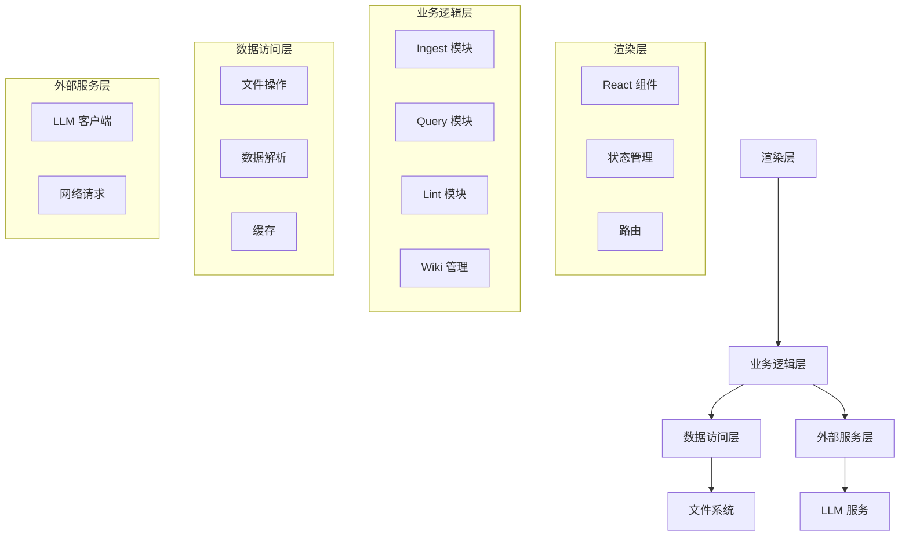

# TypeScript 迁移方案设计

## 1. 项目结构设计

### 1.1 目录结构

```
src/
├── core/                # 核心功能模块
│   ├── llm/             # LLM 客户端
│   │   ├── client.ts    # TypeScript 实现的 LLM 客户端
│   │   ├── types.ts      # 类型定义
│   │   └── index.ts      # 导出模块
│   ├── wiki/            # Wiki 管理
│   │   ├── document.ts   # Wiki 文档类
│   │   ├── manager.ts    # Wiki 管理器
│   │   ├── types.ts      # 类型定义
│   │   └── index.ts      # 导出模块
│   ├── ingest/          # 摄入功能
│   │   ├── pipeline.ts   # 摄入管道
│   │   ├── finder.ts     # 相关条目查找
│   │   ├── types.ts      # 类型定义
│   │   └── index.ts      # 导出模块
│   ├── query/           # 查询功能
│   │   ├── engine.ts     # 查询引擎
│   │   ├── types.ts      # 类型定义
│   │   └── index.ts      # 导出模块
│   ├── lint/            # 质量检查
│   │   ├── checker.ts    # 质量检查器
│   │   ├── types.ts      # 类型定义
│   │   └── index.ts      # 导出模块
│   └── common/          # 通用工具
│       ├── utils.ts      # 工具函数
│       ├── types.ts      # 通用类型定义
│       └── index.ts      # 导出模块
├── main/                # Electron 主进程
│   ├── index.ts         # 主进程入口
│   ├── preload.ts       # 预加载脚本
│   └── types.ts         # 类型定义
├── renderer/            # Electron 渲染进程
│   ├── pages/           # 页面组件
│   │   ├── DashboardPage.tsx
│   │   ├── IngestPage.tsx
│   │   ├── QueryPage.tsx
│   │   ├── LintPage.tsx
│   │   ├── ConfigPage.tsx
│   │   └── SetupPage.tsx
│   ├── components/      # 通用组件
│   │   ├── Header.tsx
│   │   ├── Footer.tsx
│   │   └── StatusIndicator.tsx
│   ├── store/           # 状态管理
│   │   ├── useStore.ts  # Zustand 状态管理
│   │   └── types.ts     # 状态类型定义
│   ├── styles/          # 样式
│   │   ├── global.css
│   │   └── components.css
│   ├── App.tsx          # 应用入口
│   ├── main.tsx         # 渲染进程入口
│   └── index.html       # HTML 模板
├── types/               # 全局类型定义
│   ├── config.ts        # 配置类型
│   ├── document.ts      # 文档类型
│   └── index.ts         # 导出类型
├── config/              # 配置文件
│   ├── default.ts       # 默认配置
│   └── schema.ts        # SCHEMA 定义
├── scripts/             # 脚本
│   ├── build.ts         # 构建脚本
│   └── lint.ts          #  lint 脚本
├── package.json         # 项目配置
├── tsconfig.json        # TypeScript 配置
├── vite.config.ts       # Vite 配置
└── README.md            # 项目说明
```

### 1.2 类型定义结构

#### `src/types/config.ts`
```typescript
interface LLMConfig {
  backend: 'ollama' | 'lmStudio' | 'openai';
  url: string;
  model: string;
  apiKey?: string;
  timeout: number;
}

interface ProjectConfig {
  projectRoot: string;
  llm: LLMConfig;
  wiki: {
    directory: string;
    rawDirectory: string;
  };
  ingest: {
    defaultPageType: string;
  };
  query: {
    maxContextTokens: number;
  };
  lint: {
    autoCheck: boolean;
  };
}

export type { LLMConfig, ProjectConfig };
```

#### `src/types/document.ts`
```typescript
interface WikiDocumentMetadata {
  title: string;
  type: string;
  tags: string[];
  created: string;
  modified: string;
  source: string;
  linked: string[];
  [key: string]: any;
}

interface WikiDocument {
  filePath: string;
  metadata: WikiDocumentMetadata;
  body: string;
  links: string[];
}

export type { WikiDocumentMetadata, WikiDocument };
```

## 2. 技术栈选择

### 2.1 核心技术栈

| 技术 | 版本 | 用途 | 替代 Python 依赖 |
|------|------|------|------------------|
| TypeScript | ^5.0.0 | 主要开发语言 | Python |
| Electron | ^28.0.0 | 桌面应用框架 | Tkinter |
| React | ^18.0.0 | UI 库 | Tkinter |
| Vite | ^5.0.0 | 构建工具 | N/A |
| Zustand | ^4.0.0 | 状态管理 | N/A |
| Node.js | ^18.0.0 | 运行时 | Python |

### 2.2 关键依赖

| 依赖 | 版本 | 用途 | 替代 Python 依赖 |
|------|------|------|------------------|
| axios | ^1.6.0 | HTTP 客户端 | requests |
| gray-matter | ^4.0.0 | Markdown frontmatter 解析 | 自定义解析 |
| fs-extra | ^11.0.0 | 文件系统操作 | pathlib, os |
| pdf-parse | ^1.1.1 | PDF 解析 | PyMuPDF |
| mammoth | ^1.6.0 | Word 解析 | python-docx |
| marked | ^11.0.0 | Markdown 解析 | 自定义解析 |
| cheerio | ^1.0.0 | HTML 解析 | BeautifulSoup |
| date-fns | ^2.30.0 | 日期时间处理 | datetime |
| zod | ^3.20.0 | 数据验证 | N/A |

### 2.3 开发工具

| 工具 | 版本 | 用途 |
|------|------|------|
| ESLint | ^8.0.0 | 代码质量检查 |
| Prettier | ^3.0.0 | 代码格式化 |
| Jest | ^29.0.0 | 单元测试 |
| Cypress | ^13.0.0 | 端到端测试 |

## 3. 架构设计

### 3.1 分层架构



### 3.2 核心模块设计

#### 3.2.1 LLM 客户端 (`src/core/llm/client.ts`)

**功能**：
- 支持多种 LLM 后端（Ollama、LM Studio、OpenAI）
- 流式和非流式响应
- 错误处理和重试机制
- 模型预热

**关键方法**：
- `chat()`：通用聊天接口
- `ingest()`：按 SCHEMA 规范编译原始资料
- `query()`：处理用户查询
- `lint()`：评估知识库质量
- `ping()`：检查后端是否可达
- `listModels()`：列出可用模型

#### 3.2.2 Wiki 管理 (`src/core/wiki/manager.ts`)

**功能**：
- Wiki 文档的创建、读取、更新、删除
- 文档搜索和索引
- 链接提取和管理
- 知识图谱构建

**关键方法**：
- `initialize()`：初始化 Wiki 目录
- `listDocuments()`：列出所有 Wiki 文档
- `saveDocument()`：创建或更新文档
- `getDocument()`：获取文档
- `deleteDocument()`：删除文档
- `searchDocuments()`：搜索文档
- `buildKnowledgeGraph()`：构建知识图谱

#### 3.2.3 Ingest 模块 (`src/core/ingest/pipeline.ts`)

**功能**：
- 原始内容处理
- LLM 编译
- Wiki 页面生成
- 索引页面生成
- 质量检查

**关键方法**：
- `runIngest()`：核心摄入流程
- `processFile()`：处理单个文件
- `generateWikiPage()`：生成 Wiki 页面
- `generateIndexPage()`：生成索引页面
- `buildKnowledgeGraph()`：构建知识图谱

#### 3.2.4 Query 模块 (`src/core/query/engine.ts`)

**功能**：
- 知识库搜索
- 上下文构建
- LLM 回答生成
- 答案保存和回填
- 话题推荐

**关键方法**：
- `runQuery()`：处理用户查询
- `searchWiki()`：搜索相关条目
- `buildContext()`：构建智能上下文
- `saveAnswer()`：保存回答
- `saveToWiki()`：保存到 Wiki
- `getTopicRecommendations()`：获取话题推荐

#### 3.2.5 Lint 模块 (`src/core/lint/checker.ts`)

**功能**：
- Wiki 质量检查
- 问题发现和分析
- 质量报告生成

**关键方法**：
- `runLint()`：执行质量检查
- `autoCheck()`：自动检查（不调用 LLM）
- `generateReport()`：生成质量报告

### 3.3 数据流设计

**Ingest 流程**：
1. 渲染层：用户上传文件或输入 URL
2. 业务逻辑层：Ingest 模块处理原始内容
3. 外部服务层：LLM 客户端编译内容
4. 数据访问层：Wiki 管理器保存生成的页面
5. 渲染层：显示处理结果

**Query 流程**：
1. 渲染层：用户输入查询
2. 业务逻辑层：Query 模块搜索相关内容
3. 外部服务层：LLM 客户端生成回答
4. 数据访问层：保存回答到 outputs 目录
5. 渲染层：显示回答和推荐

**Lint 流程**：
1. 渲染层：用户触发质量检查
2. 业务逻辑层：Lint 模块扫描 Wiki 条目
3. 外部服务层：LLM 客户端评估质量
4. 数据访问层：生成质量报告
5. 渲染层：显示质量报告

## 4. 迁移策略

### 4.1 迁移步骤

**阶段一：准备工作**（1-2 天）
1. 安装 TypeScript 依赖
2. 配置 tsconfig.json 和 vite.config.ts
3. 搭建基础项目结构
4. 实现类型定义

**阶段二：核心模块迁移**（5-7 天）
1. **LLM 客户端**：迁移到 TypeScript，支持多种后端
2. **Wiki 管理**：迁移到 TypeScript，实现文档管理功能
3. **Query 模块**：迁移到 TypeScript，实现查询和推荐功能
4. **Ingest 模块**：迁移到 TypeScript，实现摄入功能
5. **Lint 模块**：迁移到 TypeScript，实现质量检查功能

**阶段三：前端整合**（2-3 天）
1. 迁移 React 组件到 TypeScript
2. 实现状态管理
3. 优化前端界面

**阶段四：测试与优化**（3-4 天）
1. 功能测试
2. 性能测试
3. 兼容性测试
4. 代码质量优化

### 4.2 代码迁移策略

1. **逐模块迁移**：一个模块一个模块地迁移，确保每个模块迁移完成后都能正常工作
2. **类型安全**：使用 TypeScript 的类型系统确保代码质量
3. **测试覆盖**：为每个模块编写单元测试
4. **渐进式迁移**：保留 Python 版本作为参考，直到 TypeScript 版本完全稳定

### 4.3 性能优化策略

1. **文件系统操作**：使用 async/await 和 Promise 优化文件操作
2. **内存管理**：合理使用缓存，避免内存泄漏
3. **网络请求**：使用 axios 优化网络请求，支持超时和重试
4. **渲染性能**：使用 React.memo 和 useCallback 优化 React 组件
5. **LLM 调用**：支持流式响应，提高用户体验

### 4.4 兼容性策略

1. **平台兼容性**：确保在 Windows、macOS 和 Linux 上都能正常运行
2. **文件路径**：使用 path 模块处理不同平台的文件路径
3. **编码处理**：确保正确处理 UTF-8 编码
4. **错误处理**：提供友好的错误提示

## 5. 测试策略

### 5.1 单元测试

- 使用 Jest 进行单元测试
- 测试每个核心模块的关键功能
- 测试边界情况和错误处理

### 5.2 集成测试

- 测试模块间的集成
- 测试完整的流程（Ingest、Query、Lint）

### 5.3 端到端测试

- 使用 Cypress 进行端到端测试
- 测试用户界面和交互
- 测试完整的用户流程

## 6. 部署策略

### 6.1 构建配置

- 使用 Vite 构建前端
- 使用 electron-builder 打包应用
- 支持 Windows、macOS 和 Linux 平台

### 6.2 自动更新

- 实现自动更新机制
- 支持增量更新

### 6.3 发布流程

1. 构建应用
2. 测试应用
3. 发布到 GitHub Releases
4. 更新版本号

## 7. 风险评估

### 7.1 潜在风险

| 风险 | 影响 | 可能性 | 应对策略 |
|------|------|--------|----------|
| 文件处理库兼容性 | 中 | 中 | 提前测试 TypeScript 库的功能，确保与 Python 版本功能一致 |
| 性能下降 | 中 | 低 | 优化 TypeScript 代码，使用适当的异步处理和缓存策略 |
| 依赖管理复杂 | 低 | 中 | 使用 npm 或 yarn 管理依赖，确保版本兼容性 |
| 迁移时间超期 | 低 | 中 | 制定合理的时间表，预留缓冲时间，优先迁移核心功能 |

### 7.2 风险缓解

1. **详细的迁移计划**：制定详细的迁移计划，确保每个步骤都有明确的目标和时间估计
2. **渐进式迁移**：采用渐进式迁移策略，确保每个模块迁移完成后都能正常工作
3. **测试覆盖**：为每个模块编写测试，确保功能正常
4. **代码审查**：进行代码审查，确保代码质量
5. **回退机制**：保留 Python 版本作为回退方案，直到 TypeScript 版本完全稳定

## 8. 结论

TypeScript 迁移是一个重要的技术升级，可以提高代码质量和可维护性，同时保留 Electron + React 的现代化界面优势。通过合理的架构设计和迁移策略，可以构建一个更加现代化、可维护的 Karpathy LLM Wiki 系统。

迁移过程中需要注意文件处理库的兼容性、性能优化和测试覆盖，确保迁移后的系统能够稳定运行。同时，采用渐进式迁移策略，优先迁移核心功能，确保系统的稳定性和可靠性。

通过本次迁移，Karpathy LLM Wiki 将迎来技术栈的统一和升级，为未来的功能扩展和维护奠定坚实的基础。